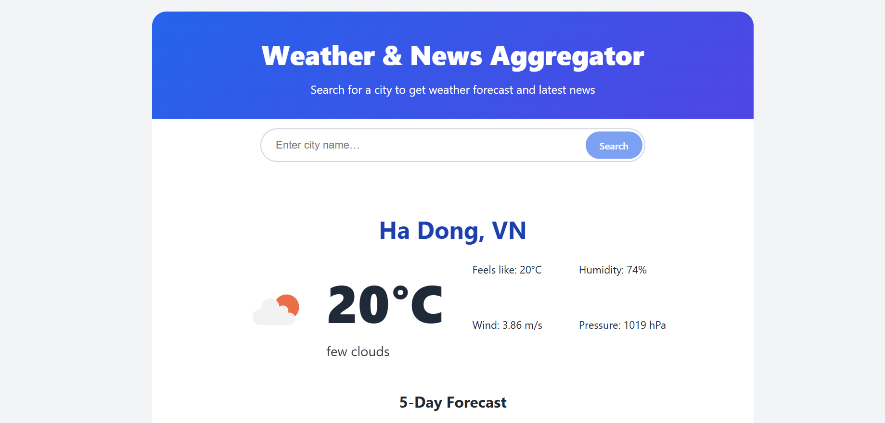
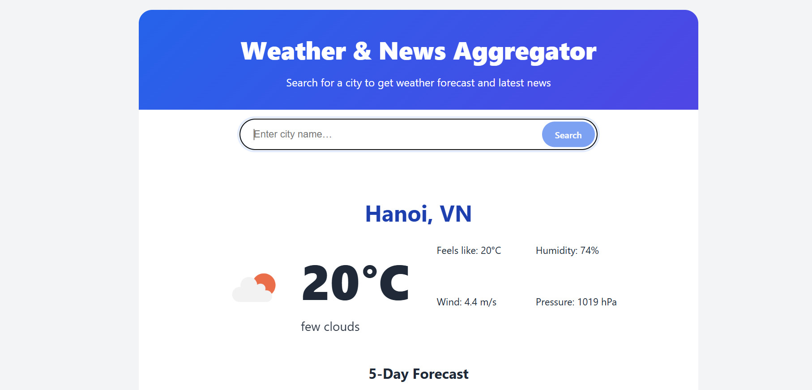
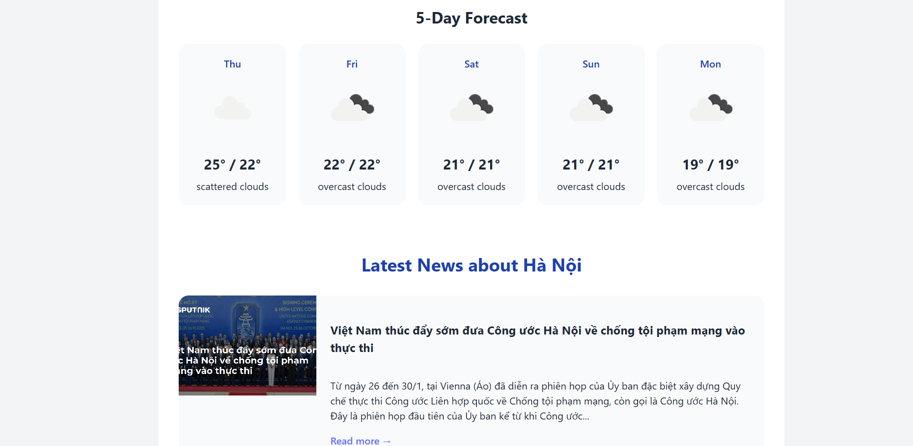
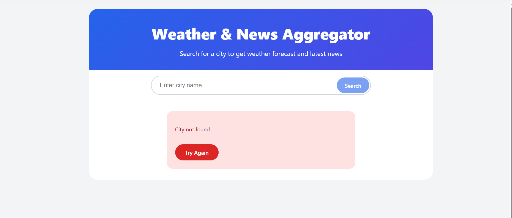

Bảng tin thời tiết và tin tức

1. Tổng quan dự án
Weather & News Aggregator là ứng dụng Front-end tập trung vào việc tích hợp dữ liệu từ các API bên ngoài, xử lý bất đồng bộ và cải thiện trải nghiệm người dùng. Dự án giúp sinh viên thực hành các kỹ thuật quan trọng trong React như gọi API, quản lý trạng thái tải dữ liệu và tối ưu khả năng tái sử dụng mã nguồn.

2. Mô tả ứng dụng

Ứng dụng cho phép người dùng tìm kiếm thông tin thời tiết theo tên thành phố và đồng thời hiển thị các bài báo mới nhất liên quan đến thành phố đó. Dữ liệu được lấy từ các nguồn API khác nhau và hiển thị theo thời gian thực.

3. Định hướng phát triển và kiến thức áp dụng

Thiết kế giao diện
- Hiển thị dự báo thời tiết trong 5 ngày bằng cách duyệt mảng dữ liệu (map).
- Bố cục giao diện chia rõ khu vực thời tiết và tin tức để tăng khả năng quan sát.

Kỹ thuật nâng cao**

- Sử dụng `useEffect` để tự động lấy vị trí hiện tại của người dùng thông qua Geolocation API ngay khi ứng dụng được khởi tạo.
- Xây dựng Custom Hook `useFetch` nhằm tái sử dụng logic gọi API, bao gồm xử lý trạng thái `loading`, `error` và `data`.
- Sử dụng `useRef` để tự động focus vào ô tìm kiếm khi trang web vừa được tải.

5. Mô tả Prototype giao diện

5.1. Giao diện khởi tạo ứng dụng

- Ô tìm kiếm được tự động focus bằng `useRef` và `useEffect`.
- Hiển thị thông báo “Detecting your location…” và spinner loading trong quá trình lấy vị trí người dùng qua Geolocation API.
- Hiển thị thơi tiết hiện tại ở vị trí hiện tại của người sử dụng (VD: Hà Đông, Hà Nội)

5.2. Giao diện hiển thị kết quả tìm kiếm (ví dụ: Hanoi)

* Khu vực thời tiết: Hiển thị thời tiết hiện tại và dự báo 5 ngày tiếp theo dưới dạng danh sách ngang.
* Khu vực tin tức: Hiển thị danh sách các bài báo liên quan đến thành phố.
* Dữ liệu được lấy từ hai API khác nhau (Weather API và News API), cho phép sinh viên thực hành gọi API song song hoặc tuần tự.

5.3. Giao diện trong trạng thái tải dữ liệu (ví dụ: London)

* Khi người dùng tìm kiếm thành phố mới, ứng dụng chuyển sang trạng thái loading.
* Custom Hook `useFetch` được sử dụng để quản lý và tái sử dụng logic xử lý dữ liệu, đồng thời hiển thị spinner và thông báo phù hợp cho người dùng.
* Khi không tìm thấy thành phố sẽ hiện thông báo

